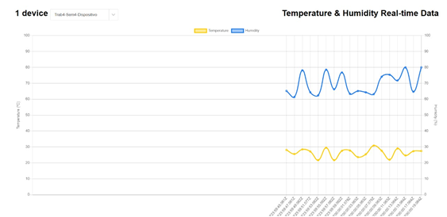
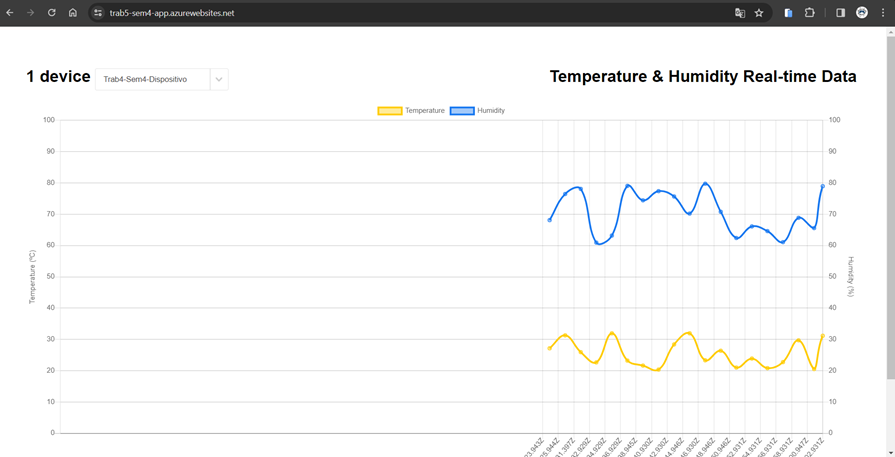
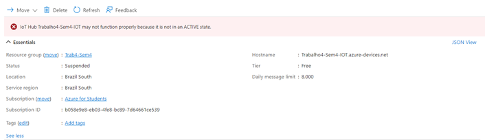

**POLO VL SILVA RIB. - CARAPICUÍBA SP**

**DESENVOLVIMENTO FULL STACK**

**NÍVEL 5:** Vamos interligar as coisas com a nuvem

**Turma:** 2024.1  
**4º Semestre - 2024**  
**Nicolas de Aguiar Silva**

**Repositório GIT:** [https://github.com/N1ckg4m3s/TRABALHOS_CURSO_FULLSTACK_4](https://github.com/N1ckg4m3s/TRABALHOS_CURSO_FULLSTACK_4)

**VAMOS INTERLIGAR AS COISAS COM A NUVEM**

**OBJETIVOS:**
1. Como criar um Hub IoT do Azure
2. Como registrar um novo dispositivo no Hub IoT.
3. Adicionando extensão Hub IoT do Azure para Visual Studio Code.
4. Gerenciando e interagindo com o Hub IoT.

**[Link para o Aplicativo](https://Trab5-Sem4-App.azurewebsites.net)**  
(Aplicativo criado em 04/03/2024)

-----------------------------------------

Atualmente o site está suspenso, pois estava usando a conta de estudante (plano gratuito por 1 mês)
